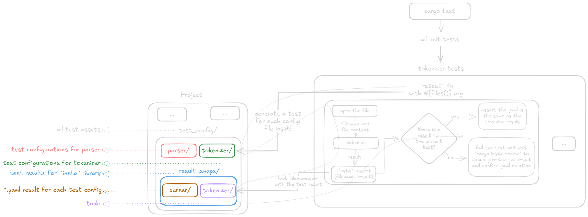

# ft_lex

## Current state / Implementation plan

Terminology:
- Nondeterministic Finite Automaton - NFA
- Deterministic Finite Automaton - DFA

- [x] No dependencies or any external libraries (only the dev ones, that are not included in release, for testing purposes)
- [ ] Write this description with details and steps.
- [ ] Draw and maintain the project schemas.
- [ ] Zero unwrap policy
- [ ] Zero warnings policy
- [ ] Structs, modules, functions and libs fully respect encapsulation
- [ ] The core part of the lexer is a library
- [ ] Doc comments for everything where it makes sense.
- [ ] libl should exist and be named libl (TODO ???)
- [ ] Implement a set of libraries to be used in the current and next projects (yacc and c compiler)
    - [ ] command line argument parser
    - [ ] regex
        - [ ] pattern is parsed to AST
        - [ ] AST transformed to the NFA
        - [ ] NFA transformed to the DTA
        - [ ] the regex is usable for regular needs
        - [ ] the regex instance should store NFA
        - [ ] is able to combine NFA later into "super" NFA
        - [ ] can transform "super" NFA to the DFA
        - [ ] fully tested
- [x] Tokenizer
    - [x] Make up a way to efficiently test different configurations
    - [x] Handles only basic parsing related to tokens, but not validate the logic (sequances, regex validation etc).
    - [x] Returns a list of token enum
    - [x] Has comprehensive error with the exact place where the error occurs
- [ ] Parser
    - [ ] Takes a list of tokens produced by tokenizer
    - [ ] Validation
        - [ ] Order
        - [ ] Right sequence
        - [ ] Logic
    - [ ] Generates all parts of the target file
        - [ ] for regex use our `regex` lib to get NFAs, combine it and transform to DFA
        - [ ] NFA is transformed to the Deterministic Finite Automaton (DFA)
        - [ ] TODO: list the rest of the main parts of the generated file that should generated
    - [ ] Fully covered with tests
- [ ] Executable
    - [ ] Executable name is `ft_lex`
    - [ ] Is able to produce C and Rust targets
    - [ ] Takes a `.l` file
    - [ ] Outputs lex.yy.c and lex.yy.rs
    - [ ] Produces comprehensive errors and warning with the position and source
    - [ ] -n
    - [ ] -t
    - [ ] -v
    - [ ] env vars
    - [ ] correct print/eprint for stdout/stderr
- [ ] End-to-end testing
- [ ] Compression

## Official documentation
- flex docs: https://perso.esiee.fr/~coupriem/Flex/flex_2.html
- lex docs: https://pubs.opengroup.org/onlinepubs/9799919799/utilities/lex.html

## Description
`ft_lex` is a Rust implementation of the POSIX `lex` tool. It's my pet project and part of the roadmap for implementing a C compiler from scratch.

### Wiki
Lex is a computer program that generates lexical analyzers ("scanners" or "lexers").

Lex reads an input stream specifying the lexical analyzer and writes source code which implements the lexical analyzer in the C programming language. **Our version can generate source in rust as well.**

### Basic usage example

### Main points

section definition lexical analyse (tokenization):
- Scope: until %%
- If start with whitespace - should be copied to the scanner
- %{}% block - should be copied as well
- definition is anything that from the beginning of the line
- definition name and pattern is separated by whitespace

section definition parsing (syntax and correct logic check):

Any such input (beginning with a `<blank>` or within `"%{"` and `"%}"` delimiter lines) appearing at the beginning of the Rules section before any rules are specified shall be written to lex.yy.c after the declarations of variables for the yylex() function and before the first line of code in yylex(). Thus, user variables local to yylex() can be declared here, as well as application code to execute upon entry to yylex().

The action taken by lex when encountering any input beginning with a <blank> or within "%{" and "%}" delimiter lines appearing in the Rules section but coming after one or more rules is undefined. The presence of such input may result in an erroneous definition of the yylex() function.

## Schema

### Project
### Tests

## Dev dependencies
insta:
- https://insta.rs/docs/quickstart/
- `curl -LsSf https://insta.rs/install.sh | sh`

parametrized test:
- https://github.com/la10736/rstest

 ## Other (Trash can TODO)

https://www.youtube.com/watch?v=54bo1qaHAfk

### REGEX:
AST is built using Recursive Descent Parsing.
### Resources:

- https://en.wikipedia.org/wiki/Recursive_descent_parser
- https://craftinginterpreters.com/parsing-expressions.html#recursive-descent-parsing

### Notes

### Parser is LL(1)
- L (First L): Input is scanned from Left to right.
- L (Second L): The parser produces a Leftmost derivation of the string according to the grammar.

- (k): The parser uses k tokens of lookahead to make its parsing decisions (i.e., to predict which grammar rule to apply next).
  - Crucially, our parser functions use .peek() to look at the next single token (k=1) to decide what to do:
  - parse_factor peeks ahead one token to see if it's a Quantifier.
  - parse_term peeks ahead one token to see if it can start another factor (for concatenation).
  - parse_expression peeks ahead one token to see if it's a Pipe.

REGEX + EXPRESSIONS: tokens to AST:
https://craftinginterpreters.com/contents.html
