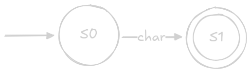
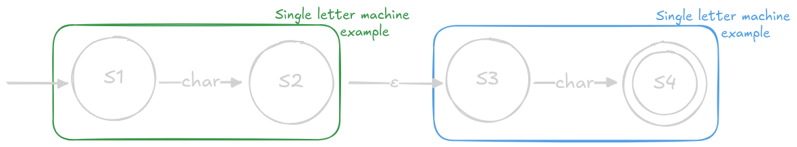
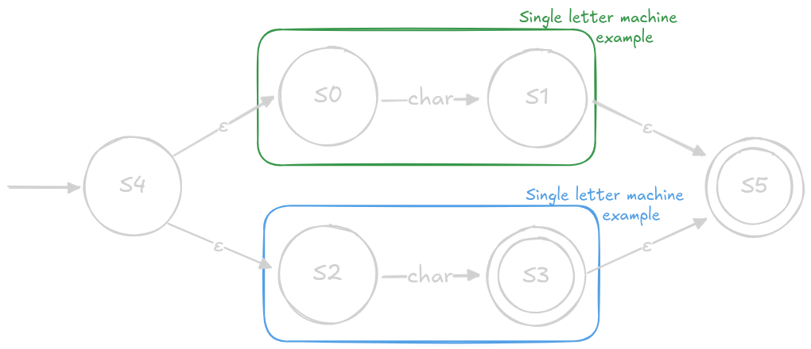
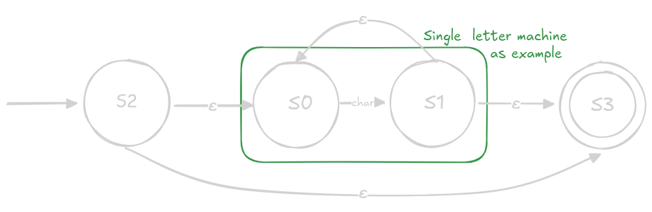
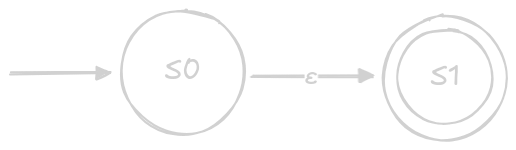
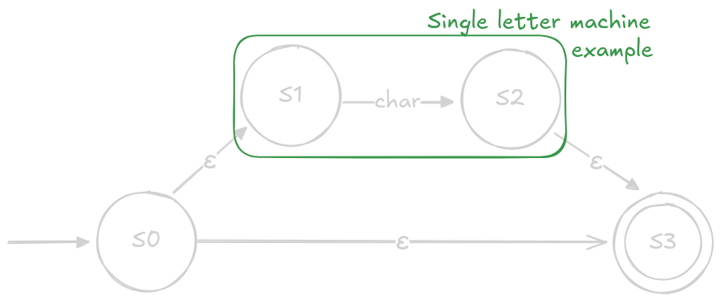

# Regex

Educatinal purpose `The extended regular expression (ERE)` implementation. The  that exposes some internals that we can reuse for our pattern matching engine

## REGEX:
AST is built using Recursive Descent Parsing.
## Resources:

- https://www.regular-expressions.info/refflavors.html - reference
- https://www.youtube.com/watch?v=DiXMoBMWMmA -  Regular expressions as finite automata
- https://www.youtube.com/watch?v=0DQyPKD8RVU - Thompson construction explained
- https://danielbv.github.io/RegexEngine/ - regex visualizer with NFA
- https://www.abstractsyntaxseed.com/blog/regex-engine/introduction - at first sight good tutorial
- https://en.wikipedia.org/wiki/Recursive_descent_parser
- https://craftinginterpreters.com/parsing-expressions.html#recursive-descent-parsing

## Scope

| Done | Feature Category        | Syntax       | Description                                                                                                                                       | Example                                         |
|:----:|:------------------------|:-------------|:--------------------------------------------------------------------------------------------------------------------------------------------------|:------------------------------------------------|
|  x   | **Atoms**              | `c`          | **Literal Character:** Matches the exact character if it's not a metacharacter.                                                                  | `cat` matches the string "cat".                 |
|  x   |                        | `.`          | **Wildcard (Dot):** Matches any single character except a newline.[1, 2]                                                                         | `c.t` matches "cat", "cot", and "c@t".          |
|      |                        | `\`          | **Escape Character:** Treats the following character literally, removing any special meaning.                                                    | `\.` matches a literal period (`.`).            |
|      | **Anchors**            | `^`          | **Start of Line:** Matches the beginning of a line or string.[3, 2]                                                                              | `^The` matches "The" at the start of a line.    |
|      |                        | `$`          | **End of Line:** Matches the end of a line or string.[3, 2]                                                                                       | `end$` matches "end" at the end of a line.      |
|  x   | **Quantifiers**        | `*`          | **Zero or More:** Matches the preceding element zero or more times (greedy).[1, 2]                                                                | `ca*t` matches "ct", "cat", "caaat", etc.       |
|      |                        | `+`          | **One or More:** Matches the preceding element one or more times (ERE-specific).[4, 1, 2]                                                         | `ca+t` matches "cat", "caaat", not "ct".        |
|      |                        | `?`          | **Zero or One:** Matches the preceding element zero or one time (optional; ERE-specific).[4, 1, 2]                                                | `colou?r` matches "color" and "colour".         |
|      |                        | `{n}`        | **Exact Count:** Matches exactly `n` repetitions of the preceding element.[5, 2]                                                                  | `[0-9]{3}` matches "123".                        |
|      |                        | `{n,}`       | **At Least `n` Times:** Matches `n` or more repetitions.[5, 2]                                                                                    | `[0-9]{2,}` matches "12", "123", etc.            |
|      |                        | `{n,m}`      | **Range of Times:** Matches between `n` and `m` repetitions (inclusive).[5, 2]                                                                    | `[0-9]{2,4}` matches "12", "123", or "1234".     |
|      | **Bracket Expressions**| `[...]`      | **Character Set:** Matches one character from the set.[5, 2]                                                                                      | `[aeiou]` matches any lowercase vowel.          |
|      |                        | `[^...]`     | **Negated Set:** Matches any one character *not* in the set. `^` must come first.[5]                                                              | `[^0-9]` matches a non-digit.                   |
|      |                        | `[a-z]`      | **Range:** Matches any character within the ASCII range.[5, 2]                                                                                    | `[a-f]` matches "a", "b", ..., "f".              |
|      | **POSIX Classes**      | `[[:alnum:]]`| Matches any alphanumeric character (`[A-Za-z0-9]`).[2, 6]                                                                                         | Matches "a", "B", or "7".                       |
|      |                        | `[[:alpha:]]`| Matches any alphabetic character (`[A-Za-z]`).[2, 6]                                                                                              | Matches "a" or "B", not "7".                    |
|      |                        | `[[:blank:]]`| Matches a space or a tab character.[7]                                                                                                            | Matches ` ` or `\t`.                            |
|      |                        | `[[:cntrl:]]`| Matches control characters.[7]                                                                                                                    | e.g., backspace, escape.                        |
|      |                        | `[[:digit:]]`| Matches any digit (`[0-9]`).[2, 6]                                                                                                                | Matches "7", not "a".                           |
|      |                        | `[[:graph:]]`| Matches visible characters (alphanumeric and punctuation).[7]                                                                                    | Matches "a", "7", or "!".                       |
|      |                        | `[[:lower:]]`| Matches lowercase letters (`[a-z]`).[2]                                                                                                           | Matches "a", not "A".                           |
|      |                        | `[[:print:]]`| Matches printable characters, including space.[7]                                                                                                 | Matches "a", "7", "!", or `" "`.                |
|      |                        | `[[:punct:]]`| Matches punctuation characters.[2, 8]                                                                                                             | Matches ".", "!", or ";".                       |
|      |                        | `[[:space:]]`| Matches whitespace (space, tab, newline, etc.).[7]                                                                                                | Matches `" "`, `\t`, or `\n`.                   |
|      |                        | `[[:upper:]]`| Matches uppercase letters (`[A-Z]`).[2]                                                                                                           | Matches "A", not "a".                           |
|      |                        | `[[:xdigit:]]`| Matches hexadecimal digits (`[0-9a-fA-F]`).[7]                                                                                                     | Matches "9", "a", or "F".                       |
|      | **Grouping & Alternation** | `(...)`  | **Grouping:** Groups expressions to apply quantifiers or capture matches.[1, 2]                                                                   | `(ha)+` matches "ha" and "hahaha".              |
|  x   |                        | `\|`         | **Alternation (OR):** Matches the full expression on either side (ERE-specific).[4, 1, 2]                                                         | `cat|dog` matches "cat" or "dog".               |
|      | **Backreferences**     | `\n`         | **Backreference:** Matches the same text as most recently matched by the `n`-th capturing group (`n` = 1–9).[2]                                  | `(a)b\1` matches "aba"; `(c.t) and \1` matches "cat and cat". |

## Thomposon construction

### Single letter

### Concatenate

### Alteration

### Kleene star

### Wildcard

### Zero or one

## Parser is LL(1)
- L (First L): Input is scanned from Left to right.
- L (Second L): The parsr produces a Leftmost derivation of the string according to the grammar.

- (k): The parser uses k tokens of lookahead to make its parsing decisions (i.e., to predict which grammar rule to apply next).
  - Crucially, our parser functions use .peek() to look at the next single token (k=1) to decide what to do:
  - parse_factor peeks ahead one token to see if it's a Quantifier.
  - parse_term peeks ahead one token to see if it can start another factor (for concatenation).
  - parse_expression peeks ahead one token to see if it's a Pipe.

REGEX + EXPRESSIONS: tokens to AST:
https://craftinginterpreters.com/contents.html

## General TODO:

## Global TODO:

- [ ] write doc and define the scope
- [ ] implement is_match and find fn
- [x] basic regex first (concatenation, alteration and Kleene star)
- [ ] pattern is parsed to AST
- [ ] AST transformed to the NFA
- [ ] NFA transformed to the DTA
- [ ] extended regex
- [ ] the regex is usable for regular needs
- [ ] the regex instance should store NFA
- [ ] is able to combine NFA later into "super" NFA
- [ ] can transform "super" NFA to the DFA
- [ ] fully tested
- [ ] can be "compiled" to a transition table to be used in generated files
